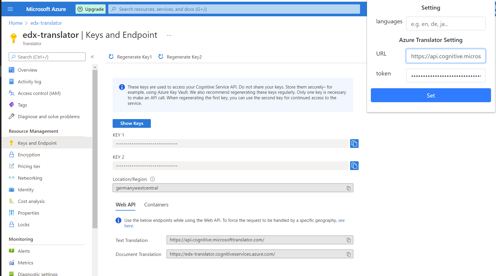
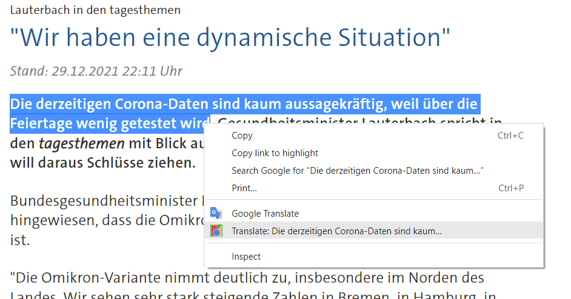
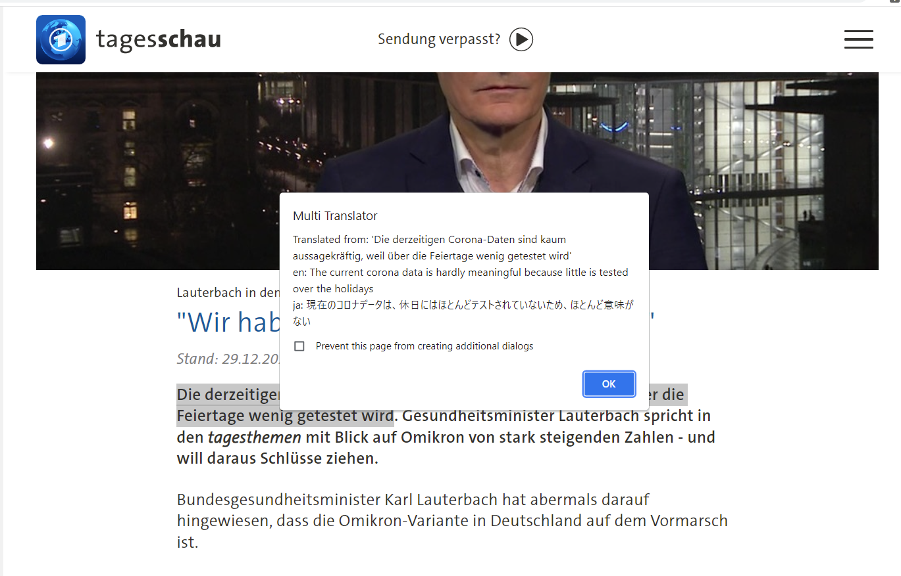

# multiTranslator
Chrome extension to translate selected text to multiple languages at once.

#### Video Demo: https://www.youtube.com/watch?v=251qa7jkMzA

# Description
This Chrome extension was developed as part of the final project for the
[edX Computer Science course](https://cs50.harvard.edu/x/2021/project/) 2021.

There exist already a multitude of extensions which are capable of translating
text. However, in the past while doing research for my studies I often desired
a way how to translate some text into multiple languages at once without the
hassle to do it manually. When translating some words or phrases into multiple
languages it's much easier to grasp the main idea and correlate their meanings,
especially if you are multilingual.

After a bit of research I found several translation engines capable of doing the
job, but the Microsoft Translator seemed the easiest to use. It's offering a REST
API to call the engine, which is well suited to be called from 
within a Chrome extension, as its logic is written in JavaScript 
which is supporting JSON natively (JSON was basically invented for JavaScript).
On top of that it offers a free plan to get quite a few translations without 
having to pay for it (at least enough for my needs).

I'm happy that the edX science class taught me the tools of how to write such an
extension which will help me and hopefully others in the future to be 
more efficient while browsing and trying to understand the WWW.

# File descriptions

## settings.html, settings.js, settings.css
Those files are used to setup the extension and uses jquery and bootstrap to 
make it look nice. The configured settings are kept in Chrome storage and retrieved 
by the main module during translation.

## main.js
This file contains the main logic to do the translation.
It's calling the Microsoft Translator with the credentials provided in the
settings and displays the result.

## manifest.json
The manifest is required for Chrome to describe the extension. 
Although the latest manifest version is 3, manifest version 2 is 
used in this project because of the easier way to describe permissions
and hook up the logic.

# Setup steps
1. Create a [Microsoft](https://www.microsoft.com/) account and 
subscribe for the [Microsoft Translator](microsoft.com/en-us/translator/)
    - Microsoft is offering a free version, 
      if you don't exceed a certain amount of translations

2. Go to Translator **Keys and Endpoint** page. Copy **KEY 1** and **Region**

3. Open the extension settings (Click the extension symbol in Chrome and open the settings).

4. Fill in the **KEY 1** (Token) and **Region**.

5. Add language codes separated by comma, without space or anything
    - e.g. en,ja
    - supported languages are listed [here](https://docs.microsoft.com/en-us/azure/cognitive-services/translator/language-support) 
   (use language codes on this page)

# How to use the extension
1. Go to any page 
2. Select text which you want to translate

3. Click Translate: ... (your selected text)
4. The result will be shown in a popup

